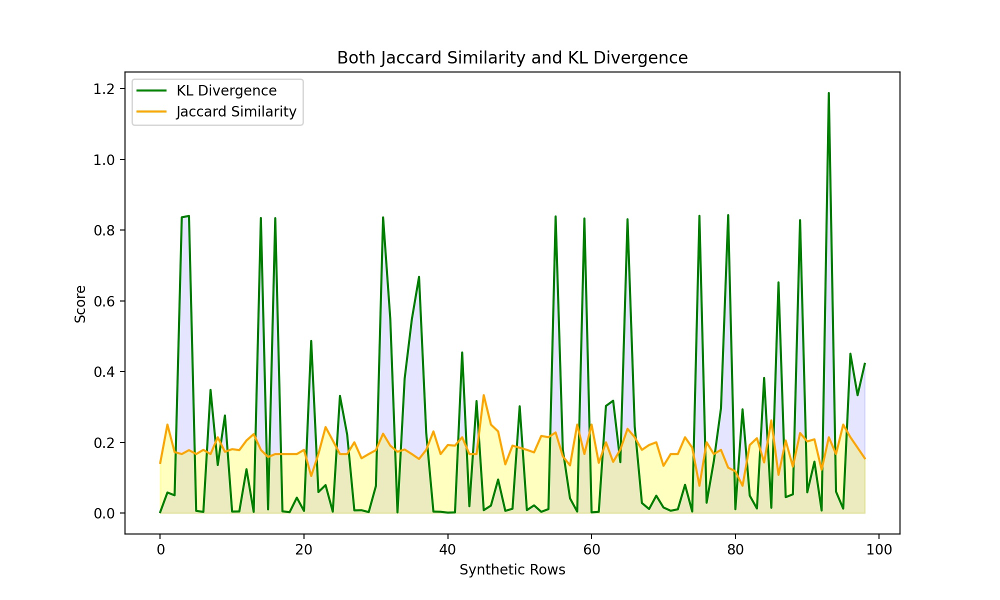

# Assessing Privacy Risks in Synthetic Data: Membership Inference Attacks on CT-GAN and DP-CTGAN Models

Data, one of the most demanding topics in the 21st century, is an essential component and represents fundamental units of potential knowledge, serving as a reflection or representation of the real world. However, as the demand for this component rises, the threat of preserving its privacy also increases. Sharing data while preserving privacy is important, specifically for fields dealing with sensitive data. This leads us to synthetic data generation as a method for preserving privacy.

Synthetic data aims to preserve the distribution of the data while hiding all the personal aspects of it. The raw data does not need to be shared, and we can rely on the generated data. GAN is one method that allows us to generate high-utility synthetic data. In this study, we have tried to explore knowledge about GAN models such as CT-GAN and DP-CTGAN and generate synthetic data by CT-GAN introducing differential privacy into it and observe the results of the degree of deviation from original data.

The membership inference attack is a famous privacy attack that works on GAN models by training shadow discriminator models and using them as white box networks. Hence, we plan to evaluate membership inference attacks on DP-CTGAN and CTGAN and compare the results through privacy preservation metrics.

## Clone the repository: 
   
   ```bash 
   git clone https://github.com/Nawal095/MIA_on_DP-CTGAN_Syn_data.git repository
   cd /path/to/the/repository 
   ``` 

This ```repository``` will be considered as ```native folder``` in the following text.

## How to Generate Synthetic Data using DP_CTGAN

### Step 0:

Run the following command to install the required package:

```bash
pip install dp-cgans
```

### Step 1:

Go to the ```dp_cgan.py``` file in the site packages directory. (Can be found in ```/path/to/environment/directory/lib/python3.9/site-packages/dp_cgans/synthesizers/dp_cgan.py```. You can find the ```path/to/environment/directory``` by running ```which python``` (for kinux/mac) or ```where python``` (for windows) on the terminal)

   - Add the following line after ```line 721```.

      ```bash
      epsilon = 1
      ```

   - Replace ```1``` with your desired ```epsilon``` value, e.g., 0.001, 5, 10 etc.

### Step 2:

Go to the dp_ctgan.py file in the native folder.

   - To change the input of the original dataset, modify line ```5``` of ```dp_ctgan.py```.

   - On line ```23```, change ```generator_<epsilon_val>.pkl```.

   - On line ```27```, change ```syn_data_file_e_<epsilon_val>.csv```.

### Step 3:

Open the terminal in the native folder and run the following command:

```bash
python scripts/dp_ctgan.py
```

### Result:

You will find the following two files in the native folder:

   1. ```generator_<chosen_epsilon_val>.pkl```

      - None of our scripts reuse these files.

      - These files may be needed for those who want to run other versions of MIA that make use of the synthetic data generator models (under white box scenario).

      - **Saving Model Parameters**
      With ```scripts/pkl_to_pth_converter.py``` file, we provide a script to load a pre-trained DP_CGAN model from a .pkl file, extract its parameters, and save them to .pth files. This process is essential for scenarios where you need to save and later reload the model parameters for further use or analysis.

        ##### Usage of ```scripts/pkl_to_pth_converter.py```

        To use this script, follow these steps:

         1. Ensure that the generator.pkl file is located in the ```models/``` directory.

         2. Run the script to load the model, extract the parameters, and save them to ```.pth``` files.

         3. The saved .```pth``` files (```generator.pth``` and ```discriminator.pth```) will be available in the ```models/``` directory for future use.

         This script is useful for scenarios where you need to save the state of a DP_CGAN model and reload it later for further analysis or deployment. By saving the model parameters, you can ensure that the model's state is preserved and can be easily restored.

   2. ```syn_data_file_e_<chosen_epsilon_val>.csv```

      - This file will be used by ```scripts/mia_with_GAN.py``` and ```scripts/similarity_score_calc.py``` files.

## How to Generate Similarity and Divergence Scores and Visualize Them

### Step 1:

   Go to the native folder and open the terminal.

### Step 2:

   Run the following command:

   ```bash
   python scripts/similarity_score_calc.py file1 file2 method graph_type
   ```

   Here:

   - ```file1```: Original Dataset file name (e.g., ```data/MelanomaLight.csv```)

   - ```file2```: Synthetic Dataset file name (e.g., ```data/syn_data_file_e_0.5.csv```)

   - ```method```: KL | Jaccard | Both

   - ```graph_type```: line | radar

### Why and How We Used KL Divergence and Jaccard Similarities

   In our project, we utilized KL Divergence and Jaccard Similarities to assess the similarity and divergence between original and synthetic datasets. These metrics help us understand how closely the synthetic data mimics the original data, which is crucial for evaluating the effectiveness of our synthetic data generation methods.

   #### KL Divergence

   **KL Divergence (Kullback-Leibler Divergence)** is a measure of how one probability distribution diverges from a second, expected probability distribution. It is particularly useful for comparing the distributions of continuous variables.

   **Why We Used KL Divergence:** KL Divergence helps us quantify the difference between the probability distributions of the original and synthetic datasets. A lower KL Divergence indicates that the synthetic data closely follows the distribution of the original data, which is desirable for maintaining data utility.

   **How We Used KL Divergence:** We calculated KL Divergence for each pair of rows between the original and synthetic datasets. A row from synthetic dataset is used to calculate KL divergence score with respect to all the rows in original dataset. Then the ```min``` value from the generated scores is selcted to represent that row / data-point in the synthetic dataset. This process is reiterated for each row in the synthetic dataset. *By doing so, we have noticed that some data-point in the synthetic dataset have close to 0 divergence frim some rows in the original dataset, but upon close inspection,  we found that this score was always **greater that 0** and **never equal to 0**. This is hard to determine from the generated graph; so, we resorted to calculate Jaccard similaty as well to explicitly show that no data-point in the synthetic dataset is exactly similar to any data-point in original dataset.*   

   #### Jaccard Similarity

   **Jaccard Similarity** is a measure of similarity between two sets, defined as the size of the intersection divided by the size of the union of the sets. It is particularly useful for comparing binary or categorical data.

   **Why We Used Jaccard Similarity:** Jaccard Similarity helps us quantify the similarity between the original and synthetic datasets in terms of categorical variables. A higher Jaccard Similarity indicates that the synthetic data retains the categorical relationships present in the original data.

  **How We Used Jaccard Similarity:** We calculated Jaccard Similarity for each pair of rows between the original and synthetic datasets. A row from synthetic dataset is used to calculate Jaccard similarity score with respect to all the rows in original dataset. Then the ```max``` value from the generated scores is selcted to represent that row / data-point in the synthetic dataset. This process is reiterated for each row in the synthetic dataset.

   #### Visualization

   We provided two types of visualizations to help interpret the similarity and divergence scores: line charts and radar charts.

   **Line Charts:** Line charts plot the similarity and divergence scores across synthetic rows, providing a clear view of how these scores vary.

   **Radar Charts:** Radar charts (or spider charts) provide a circular visualization of the scores, allowing for an intuitive comparison of multiple metrics.

By using KL Divergence and Jaccard Similarity, we can comprehensively evaluate the similarity and divergence between original and synthetic datasets, ensuring that the synthetic data maintains the utility and privacy of the original data. **An example of Line Chart Visualization is provided below:**



## How to Run Membership Inference Attack (MIA)

### Step 0: Setting Up the Conda Environment 

To create a conda environment with the required dependencies, follow these steps: 
   
   1. Create the conda environment using the `environment.yml` file: 
   
      ```bash 
      conda env create -f environment.yml 
      ``` 
   
   2. Activate the conda environment: 
   
      ```bash 
      conda activate mia_synthetic 
      ``` 
   
   Now you can run the scripts in the repository using the activated conda environment. 
   This environment holds all the necessary dependencies to run MIA.

### Step 1:

Go to the native folder. This will be considered as the native folder for the MIA attack. 
Open the terminal (bash) from the native folder.

### Step 2:

Run the following command to run MIA:

```bash
python scripts/mia_with_GAN.py file1 file2
```

Here:

   - ```file1```: Synthetic Dataset file name (e.g., ```data/syn_data_file_e_0.1.csv```)

   - ```file2```: Auxiliary Dataset file name (e.g., ```data/auxiliary_file_melanoma_heavy.csv```)

### Output

After running the MIA, the output includes:

   ##### 1. Prediction: 
   Indicates whether the synthetic dataset contains data points that resemble those from the original dataset (IN or OUT).

   ##### 2. Indices of Data Points: 
   Lists the indices of the data points in the synthetic dataset that are predicted to resemble the original dataset.

   #### Example Output

   ```bash
      Prediction: IN
      Indices of data points resembling original dataset: [0, 5, 12, 23, 45]
   ```

   #### Interpretation

   1. **Prediction**: If the prediction is IN, it means that the synthetic dataset contains data points that are similar to those in the original dataset, indicating a potential privacy risk.

   2. **Indices of Data Points**: The listed indices correspond to the specific data points in the synthetic dataset that are identified as resembling the original dataset. These indices can be used to further investigate and mitigate privacy risks.

## Some Important Notes

Due to the constraints of computational resources, and lack of access to GPUs, we explored some literature to find more budget friendly approaches:

   - First, we tried to take the (100) Shadow models completely out of the equation and directly trained the attack model (random forest) on the shadow datasets. These shadow datasets were hand crafted by us in the following ways: 

      1. Synthetic dataset + (1 or more) Auxiliary datapoints sampled from the same source as Original dataset = IN label, and 
   
      2. **Only** Synthetic dataset = OUT label 
      
      *This method proved to be too simplistic.* 
   
   - After that, we explored more research papers to find more balanced but still computationally inexpensive approaches and found that these shadow models (usually which are generative models) can be implemented with simple regression models, such as liner regression. - This approach strikes a middle ground as it is not too simplistic and also not too expensive. 
   
   - After exploring these options and running some tests, we have finally decided to use Generative models, such as Gaussian Mixture Models (GMM), Bayesian networks, and Variational Auto Encoders (VAE). We finally ended up using Generative Adversarial Network (GAN) as shadow models as we have already used a version of GAN (DP-CTGAN) to generate the synthetic data itself. 
   
   We are presenting our data using GAN as the shadow models. 
   
   ***We did not empirically study the effects of using different attack models other than Random forests, as we have found this to be used in most of the literatures as a good and acceptable classifier model.***
